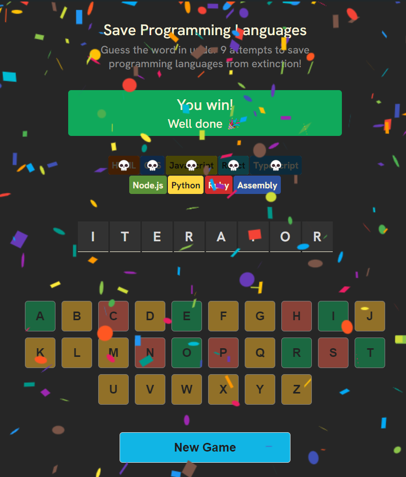

# Save Programming Languages Game

A word-guessing game where your mission is to save programming languages from extinction.
In this game, you will guess letters to reveal a hidden programming term while eliminating languages with each wrong guess. The goal is to complete the word before all languages are lost.

## Features

-  **Word Guessing**: Guess letters to uncover a hidden programming term
-  **Dynamic Language Elimination**: Each wrong guess removes a programming language
-  **Visual Keyboard**: Interactive keyboard shows correct/incorrect guesses
-  **Animated Celebrations**: Confetti animations when you win
-  **Language Chips**: Visual representation of programming languages with death indicators
-  **Message System**: Farewell messages when languages are lost and game status updates
-  **Responsive Design**: Playable on various devices and screen sizes

## How to Play

1. Start by clicking letters on the virtual keyboard
2. Correctly guessed letters will appear in the word spaces
3. Incorrect guesses will eliminate a programming language
4. Try to complete the word before all languages are lost
5. Win by revealing the entire word, lose if all languages are eliminated
6. Click "New Game" to play again with a different word

## Technologies Used

-  React 19.0
-  React Confetti for win celebrations
-  CSS for styling
-  Vite for development and building
-  GitHub Pages for deployment
